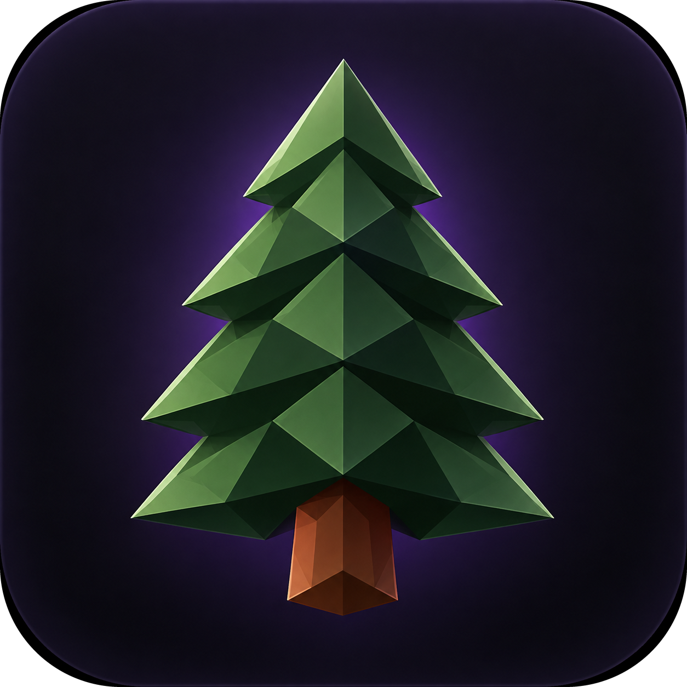

<p align="center">
  <a href="https://realse62em.github.io/Pine-Launcher/">
    
  </a>
</p>
<p align="center">
  <a href="https://realse62em.github.io/Pine-Launcher/"><strong>Visit the Pine Launcher website</strong></a>
</p>

# Pine Launcher

Pine Launcher is a Windows and Linux Minecraft launcher with isolated instances, Microsoft and offline accounts, Modrinth content management, verified shared caching, and an iOS-inspired glass interface.

Windows 10/11, Debian-based Linux distributions, and Arch Linux are supported.

## Download and install

1. Download the newest package from the [Releases](https://github.com/RealSe62em/Pine-Launcher/releases) page.
2. On Windows, run the installer that matches your PC:
   - `PineLauncherSetup-x64.exe` — Intel or AMD 64-bit PCs.
   - `PineLauncherSetup-arm64.exe` — Windows on ARM PCs.
3. On Debian, Ubuntu, Linux Mint, or another Debian-based distribution, install the x64 package:

```bash
sudo apt install ./PineLauncher-1.2.0-linux-amd64.deb
```

4. On Arch Linux, install the native x64 package:

```bash
sudo pacman -U ./PineLauncher-1.2.0-archlinux-x64.pacman
```

Then open Pine Launcher from the application menu or run `pine-launcher`.

Pine downloads and verifies the Java runtime required by the selected Minecraft version on both platforms, so manual Java installation should not normally be needed. Linux Java archives are verified and extracted with the system `tar` utility.

## Features

- Separate Vanilla, Fabric, Quilt, Forge, and NeoForge instances.
- Multiple Microsoft and offline accounts with individual switching and deletion.
- Modrinth discovery plus optional CurseForge mods, packs, and data packs using an approved API key.
- A polished frequently visited grid with real server/world details and one-click Play.
- Shared verified caches for game assets, libraries, versions, and mods—so matching files are reused instead of downloaded again for every new instance.
- Clear launch stages and selectable, copyable logs for troubleshooting.
- Transactional instance copies and imports with cancellation, category selection, private-data exclusion, and rollback of partial work.
- Pine archives, lightweight Pine manifests, and standards-compatible Modrinth `.mrpack` import/export.
- Automatic restore points, world management, managed-pack lifecycle controls, and privacy-safe crash diagnosis.

CurseForge requires an approved third-party API key. Add it under **Settings → Integrations** or set `PINE_CURSEFORGE_API_KEY`; Pine does not ship a private developer key in source control.

## Privacy and safety

Microsoft login uses OAuth with PKCE. Microsoft refresh tokens are saved only when Electron's operating-system-backed secure storage is available; Pine refuses to persist them as plaintext. Content downloads use HTTPS, verify available hashes, reject unsafe filenames, resolve required dependencies, and roll back partial installations.

Instances, encrypted account data, settings, caches, and diagnostic logs are stored in Electron's per-user application-data directory (`%APPDATA%` on Windows and `~/.config` on typical Linux desktops). Uninstalling Pine removes application files but keeps worlds and other user data.

On Linux, Microsoft account persistence requires a working desktop Secret Service/keyring such as GNOME Keyring, KWallet, KeePassXC, or oo7. Pine will not save refresh tokens as plaintext if secure storage is unavailable. Arch users whose desktop does not already provide one can install GNOME Keyring with `sudo pacman -S gnome-keyring`.

The current installer is unsigned. Windows may therefore show an "Unknown publisher" notice. Verify the installer checksum published with each release and never disable antivirus protection globally.

## Troubleshooting

- **Java error:** Pine installs the Java runtime required by the Minecraft version. You can also choose a custom Java executable in Settings.
- **Launch failure:** Open the instance **Logs** tab and copy the selectable log text when asking for help.
- **Installer problem:** On Windows, choose x64 for Intel/AMD or ARM64 for Windows on ARM. On Debian, use `sudo apt install ./package.deb`; on Arch, use `sudo pacman -U ./package.pacman`, so required desktop libraries are resolved automatically.
- **Uninstall:** Use **Installed apps** on Windows, `sudo apt remove pine-launcher` on Debian, or `sudo pacman -R pine-launcher` on Arch. Worlds and other user data are retained.

## Building from source on Windows

Install Node.js 22.12 or newer, then run from Command Prompt or PowerShell:

```powershell
npm.cmd install
npm.cmd test
npm.cmd start
```

Use `npm run dev` to open Electron developer tools. Build Windows installers with:

```powershell
npm run build:installer
```

## Building from source on Debian

Install Node.js 22.12 or newer, `npm`, and the standard Debian packaging tools. Building the Arch package from Debian also requires `libarchive-tools`:

```bash
sudo apt install libarchive-tools
npm ci
npm test
npm start
```

Build a native x64 `.deb` with:

```bash
npm run build:deb:x64
```

The package is written to `dist-native/`. An ARM64 package can be built on a suitable builder with `npm run build:deb:arm64`.

## Building from source on Arch Linux

Install Node.js 22.12 or newer and npm, then run:

```bash
sudo pacman -S --needed nodejs npm base-devel
npm ci
npm test
npm start
```

Build a native x64 Pacman package with:

```bash
npm run build:pacman:x64
```

The package is written to `dist-native/` and can be installed with `sudo pacman -U ./dist-native/PineLauncher-*-archlinux-x64.pacman`.

## Release checklist

1. Run `npm test` and `npm audit`.
2. Smoke-test Vanilla, Fabric, Quilt, and Forge with fresh instances.
3. Test install, launch, and uninstall on Windows, Debian, and Arch Linux.
4. Test managed Java, Microsoft secure storage, Vanilla, Fabric, Quilt, Forge, and NeoForge on each platform.
5. Publish the installer/package files and their SHA-256 checksums in a GitHub Release.

Built with Electron and `minecraft-launcher-core`. Licensed under MIT.
